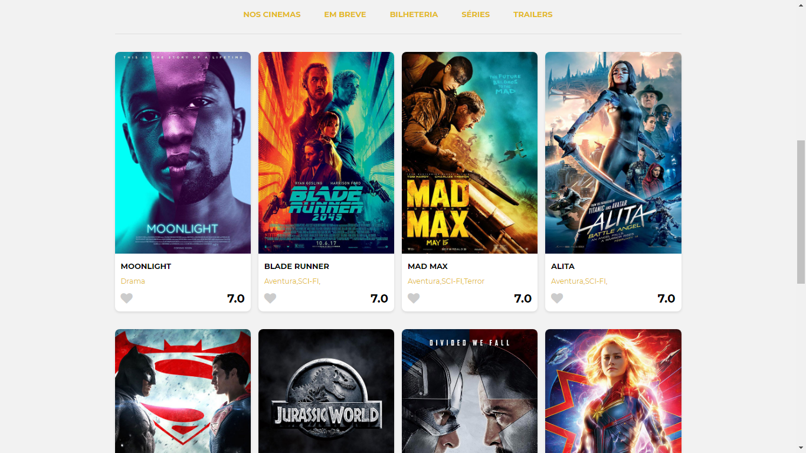
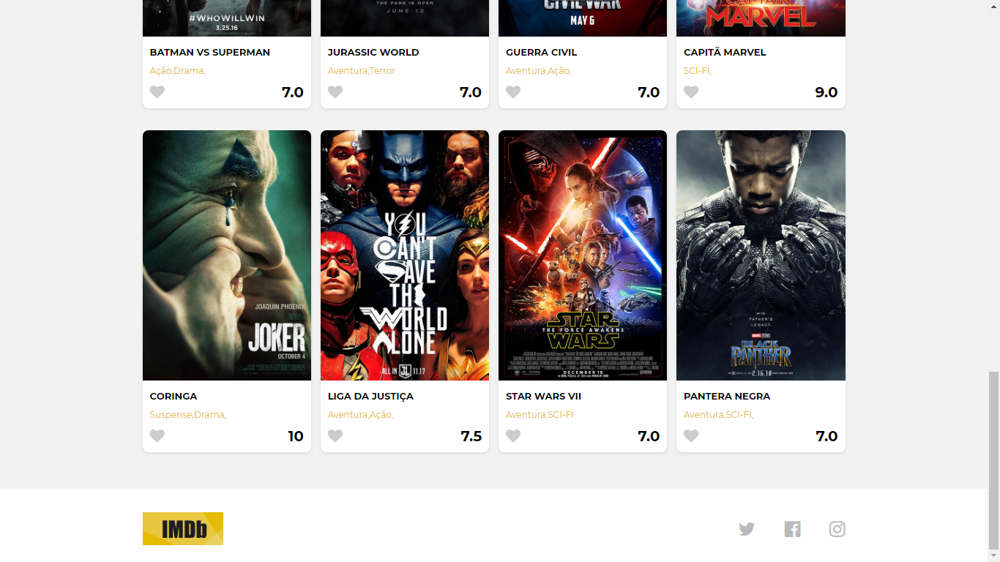

<h1>🎥 IMDB - Internet Movies Database</h1>

<h2>Objetivo</h2>

O desafio é desenvolver a página inicial de um site de avaliação de filmes (IMDB - Internet Movies Database) utilizando apenas HTML5 e CSS3.

Preview: 👉 <a href="#">IMDB Codenation</a>

<h2>Utilizados</h2>
<ul>
<li>HTML5</li>
<li>CSS3</li>
<li>Google Fonts</li>
<li>Fontawesome</li>
</ul>

<h2>Tasklist - Mapeamento do projeto</h2>

- [x] Página Inicial
- [ ] Redirecionar para as redes sociais
- [ ] Redicionar para home (logotipo)
- [ ] Página Lançamentos
- [ ] Página Crítica
- [ ] Página Em Cartaz
- [ ] Link para categoria dos títulos (gênero)
- [ ] Pop-up avaliar (nota)
- [ ] Página Detalhes do título
- [ ] Página de login
- [ ] Página de cadastro
- [ ] Menu personalizado

<h2>Layout</h2>

